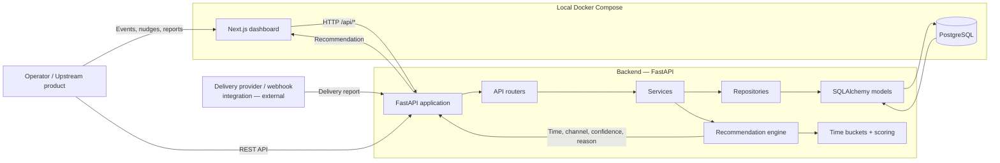
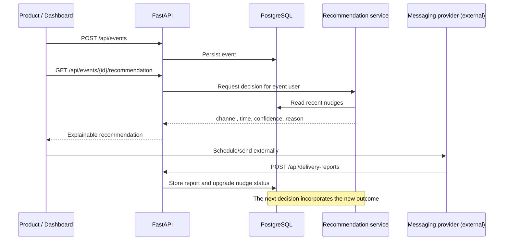
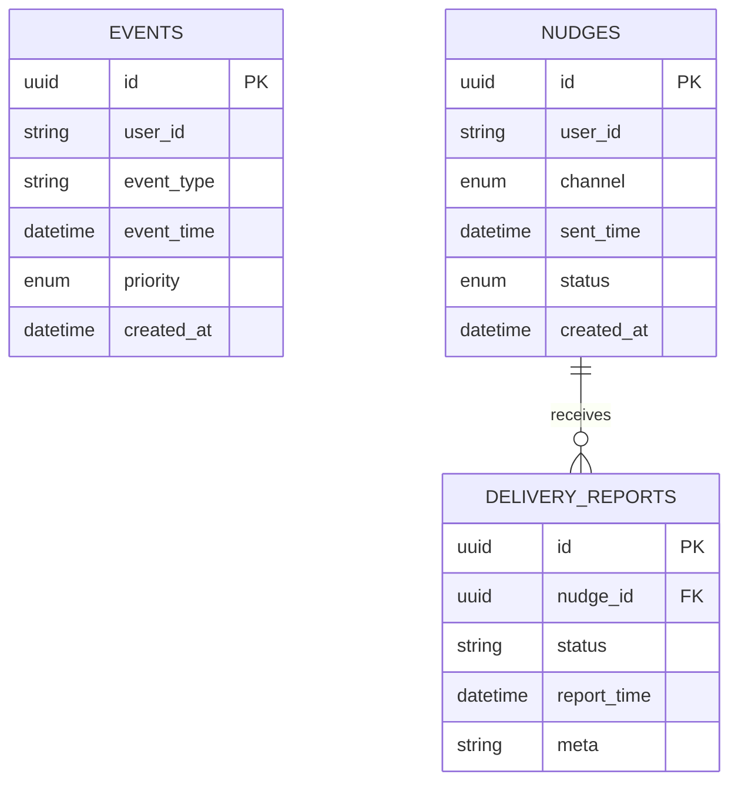

# NudgeFlow — Intelligent Communication Timing Engine

NudgeFlow is an explainable, event-driven decision service that recommends the **best channel** and **next send time** for a customer communication. It turns historical nudge outcomes—delivery, opens, clicks, replies, and failures—into a simple, inspectable engagement profile.

It is deliberately provider-agnostic: NudgeFlow decides *when* and *how* to contact someone; a downstream scheduler or messaging provider is responsible for actually delivering the message.


## Why it exists

Customer events such as a payment due date, abandoned cart, renewal, signup, or support follow-up have different urgency, but a poorly timed message can still be ignored. NudgeFlow closes that feedback loop:

1. Record the customer event.
2. Record each outbound nudge and its channel.
3. Ingest provider delivery reports as they arrive.
4. Score recent engagement by time window and channel.
5. Return an explainable recommendation for the next communication.

## Product capabilities

- Event ingestion with a user ID, event type, event timestamp, and priority.
- Four supported channels: WhatsApp, email, SMS, and push.
- Five engagement states: delivered, opened, clicked, replied, and failed.
- Recency-weighted scoring across seven time buckets.
- Safe fallback scheduling for events belonging to users with no engagement history.
- A monotonic delivery-status update rule that protects against out-of-order webhooks.
- User analytics for engagement by time bucket and channel.
- A responsive Next.js workspace for manually exercising the full workflow.
- PostgreSQL migrations, Docker Compose, seed data, API docs, and automated backend tests.

> **Current scope:** this repository is a decisioning engine and demo workspace. It does not send messages, manage provider credentials, authenticate users, or run a background scheduler.

## Architecture



### Decision lifecycle



## Repository map

```text
.
├── backend/
│   ├── app/
│   │   ├── routers/          # HTTP endpoints and validation boundaries
│   │   ├── services/         # Event, nudge, analytics, recommendation logic
│   │   ├── repositories/     # SQLAlchemy persistence operations
│   │   ├── models/           # Event, nudge, and delivery-report tables
│   │   ├── schemas/          # Pydantic request and response contracts
│   │   └── utils/            # Time buckets and engagement scoring helpers
│   ├── alembic/              # Database migration environment and revisions
│   ├── tests/                # API and behaviour tests
│   ├── Dockerfile
│   ├── requirements.txt
│   └── seed.py               # Disposable demo-data generator
├── frontend/
│   ├── app/                  # Next.js App Router entry point and global styles
│   ├── components/           # Event, nudge, report, analytics, decision UI
│   ├── lib/api.ts            # Typed browser API client
│   ├── public/demo/          # README and UI preview assets
│   └── Dockerfile
├── assests/                  # Product screenshots (legacy folder name retained)
├── docker-compose.yml        # Frontend, API, and PostgreSQL development stack
├── vercel.json               # Frontend/backend route configuration for Vercel
└── .env.example              # Docker PostgreSQL defaults
```

## Data model



`events` and `nudges` both use `user_id` as their application-level correlation key. A delivery report belongs to exactly one nudge through `nudge_id`. The initial Alembic migration creates indexes on `events.user_id` and `nudges.user_id`.

### Enumerations

| Field | Allowed values |
| --- | --- |
| Event priority | `LOW`, `MEDIUM`, `HIGH`, `CRITICAL` |
| Nudge channel | `WHATSAPP`, `EMAIL`, `SMS`, `PUSH` |
| Nudge/report status | `DELIVERED`, `OPENED`, `CLICKED`, `REPLIED`, `FAILED` |

## Recommendation engine

The engine examines a user's nudges within a configurable lookback window (30 days by default). It does not use a black-box model; every decision is deterministic and can be explained from stored records.

### 1. Group communications by send-time bucket

| Key | Local hour range | Representative recommended hour | Eligible for recommendation |
| --- | --- | ---: | --- |
| `6AM-9AM` | 06:00–08:59 | 07:00 | Yes |
| `9AM-12PM` | 09:00–11:59 | 10:00 | Yes |
| `12PM-3PM` | 12:00–14:59 | 13:00 | Yes |
| `3PM-6PM` | 15:00–17:59 | 16:00 | Yes |
| `6PM-9PM` | 18:00–20:59 | 19:00 | Yes |
| `9PM-12AM` | 21:00–23:59 | 22:00 | Yes |
| `12AM-6AM` | 00:00–05:59 | 02:00 | Analytics only |

Time buckets are calculated from the hour stored in `sent_time`. The implementation does not yet apply an individual user timezone; production deployments should store an IANA timezone per user and score/send in that local timezone.

### 2. Convert outcomes into engagement signals

| Latest nudge status | Base score |
| --- | ---: |
| `REPLIED` | 5 |
| `CLICKED` | 3 |
| `OPENED` | 2 |
| `DELIVERED` | 1 |
| `FAILED` | -3 |

Recent behavior counts more. For each nudge:

```text
recency_weight = 1 / (days_old + 1)
weighted_score = base_status_score × recency_weight
```

The service sums those weighted scores separately by time bucket and channel. It chooses the highest-scoring non-overnight bucket and the highest-scoring channel with a positive score. If all channel scores are non-positive, it falls back to WhatsApp.

### 3. Calculate confidence and next send time

```text
confidence = best_eligible_bucket_score / sum(abs(all eligible bucket scores))
```

Confidence is rounded to two decimal places and bounded between `0.0` and `1.0`. The selected time is the next occurrence of that bucket's representative hour; it is never scheduled before the associated event timestamp.

### Cold-start behavior

An event recommendation always returns a decision, even with no history:

- Channel: `WHATSAPP`
- Confidence: `0.0`
- Timing: five minutes from now when it is daytime/evening, otherwise 09:00 in the next safe morning window
- Reason: explicitly identifies the choice as a fallback

By contrast, a user-only request (`GET /api/recommendation/{user_id}`) returns `404` when the user has no recent nudge history, because it has no event to anchor a fallback schedule.

### Delivery-report ordering rule

Provider webhooks can arrive late or out of order. NudgeFlow stores every report, but only updates the nudge's current status when the incoming state is at least as strong as the stored state:

```text
FAILED < DELIVERED < OPENED < CLICKED < REPLIED
```

For example, a delayed `DELIVERED` report cannot overwrite a previously observed `REPLIED` state. This protects the data used for future recommendations.

## API

When the API is running, interactive OpenAPI documentation is available at [`/docs`](http://localhost:8000/docs).

| Method | Endpoint | Description |
| --- | --- | --- |
| `GET` | `/health` | Liveness response: `{"status":"ok"}` |
| `POST` | `/api/events` | Create an event |
| `GET` | `/api/events` | List events; optional `user_id`, `skip`, `limit` |
| `GET` | `/api/events/{event_id}` | Fetch one event |
| `GET` | `/api/events/{event_id}/recommendation` | Produce event-anchored decision; optional `lookback_days` |
| `POST` | `/api/nudges` | Record an outbound nudge |
| `GET` | `/api/nudges` | List nudges; optional `user_id`, `skip`, `limit` |
| `GET` | `/api/nudges/{nudge_id}` | Fetch one nudge |
| `POST` | `/api/delivery-reports` | Store a report and update current nudge status if stronger |
| `GET` | `/api/recommendation/{user_id}` | Produce a user-level decision; optional `lookback_days`, `event_id` |
| `GET` | `/api/users/{user_id}/analytics` | Return score distributions and the user-level decision |

`lookback_days` accepts integers from `1` through `365`, and defaults to `30`.

### Example: complete API flow

Create a customer event:

```bash
curl -X POST http://localhost:8000/api/events \
  -H "Content-Type: application/json" \
  -d '{
    "user_id": "customer_42",
    "event_type": "payment_due",
    "event_time": "2026-08-04T10:00:00Z",
    "priority": "HIGH"
  }'
```

Record a historical nudge:

```bash
curl -X POST http://localhost:8000/api/nudges \
  -H "Content-Type: application/json" \
  -d '{
    "user_id": "customer_42",
    "channel": "WHATSAPP",
    "sent_time": "2026-08-03T19:00:00Z",
    "status": "DELIVERED"
  }'
```

Submit a provider outcome:

```bash
curl -X POST http://localhost:8000/api/delivery-reports \
  -H "Content-Type: application/json" \
  -d '{
    "nudge_id": "<nudge-uuid>",
    "status": "REPLIED",
    "meta": "provider_message_id_123"
  }'
```

Request the decision for the created event:

```bash
curl http://localhost:8000/api/events/<event-uuid>/recommendation
```

Example response:

```json
{
  "user_id": "customer_42",
  "event_id": "b1ffb97a-4afd-4e91-8943-6c91b495d032",
  "recommended_time": "2026-08-04T19:00:00+00:00",
  "channel": "WHATSAPP",
  "confidence": 0.91,
  "reason": "User has replied to 4 Whatsapp nudges between 6 PM - 9 PM during the last 30 days."
}
```

## Run locally

### Option A — Docker Compose (recommended)

**Prerequisite:** Docker Desktop with Docker Compose.

```bash
cp .env.example .env
docker compose up --build
```

On Windows PowerShell:

```powershell
Copy-Item .env.example .env
docker compose up --build
```

| Service | Local address | Notes |
| --- | --- | --- |
| Dashboard | http://localhost:3000 | Next.js production build |
| API + Swagger | http://localhost:8000 / http://localhost:8000/docs | Alembic runs at container startup |
| PostgreSQL 16 | `localhost:5432` | Backed by the `pgdata` Docker volume |

Populate the demo database after the stack is healthy:

```bash
docker compose exec backend python seed.py
```

> `seed.py` deletes all existing events and nudges before generating demo records. Run it only against disposable local data.

### Option B — Local processes with SQLite

This mode is ideal for a quick demo without Docker. SQLite is not recommended for shared or production deployments.

**Prerequisites:** Python 3.12+, Node.js 20+, and npm.

Backend terminal:

```powershell
cd backend
python -m venv .venv
.\.venv\Scripts\Activate.ps1
pip install -r requirements.txt
$env:DATABASE_URL = "sqlite:///./ict_engine.db"
python -c "from app.database import Base, engine; import app.models; Base.metadata.create_all(bind=engine)"
python -m uvicorn app.main:app --reload --port 8000
```

Frontend terminal:

```powershell
cd frontend
Copy-Item .env.local.example .env.local
npm install
npm run dev
```

Open http://localhost:3000.

### Local PostgreSQL development

Set `DATABASE_URL` in `backend/.env`, apply migrations, and start the API:

```bash
cd backend
pip install -r requirements.txt
alembic upgrade head
uvicorn app.main:app --reload
```

## Configuration

| Variable | Used by | Default | Purpose |
| --- | --- | --- | --- |
| `DATABASE_URL` | Backend | `postgresql+psycopg2://ict_user:ict_password@db:5432/ict_engine` | SQLAlchemy connection URL |
| `APP_ENV` | Backend | `development` | Environment label |
| `POSTGRES_USER` | Docker/PostgreSQL | `ict_user` | Database user |
| `POSTGRES_PASSWORD` | Docker/PostgreSQL | `ict_password` | Database password |
| `POSTGRES_DB` | Docker/PostgreSQL | `ict_engine` | Database name |
| `NEXT_PUBLIC_API_BASE_URL` | Frontend | Local: `http://localhost:8000`; deployed: same-origin `/api` | Optional external API origin used by browser requests |

Use `.env.example`, `backend/.env.example`, and `frontend/.env.local.example` as development templates. Do not commit real secrets; inject them through your deployment platform or a managed secret store.

## Frontend workspace

The dashboard is both a product demo and a manual API test surface.

1. **Create Event** records a business trigger and immediately displays its event-level decision.
2. **Create Nudge** adds historical or newly sent communications for a user.
3. **Submit Delivery Report** attaches an outcome to a nudge and refreshes the learning signal.
4. **Recommendation** retrieves the best learned channel and time for a user.
5. **Analytics** displays recency-weighted engagement by time bucket and channel.
6. **Theme toggle** switches between Deep Zinc dark mode and Warm Slate light mode.

For a quick personalised demo, create several `WHATSAPP` nudges for one user around 19:00, mark them `REPLIED`, then create an event for that user. The engine should favour the 6 PM–9 PM bucket and WhatsApp.

## Screenshots

| Workflow | Preview |
| --- | --- |
| Event creation and immediate decision |  |
| Nudge recording |  |
| Delivery-report ingestion |  |
| Engagement analytics |  |

## Quality checks

Backend tests use an in-memory SQLite database; PostgreSQL is not required:

```bash
cd backend
python -m pytest -v
```

The test suite covers event CRUD, recommendation preference and cold-start behavior, analytics, delivery-status upgrades, invalid status validation, and protection from downgraded out-of-order reports.

Validate TypeScript and produce the optimized frontend build:

```bash
cd frontend
npm exec tsc -- --noEmit
npm run build
```

## Deployment notes

- The backend Docker image applies `alembic upgrade head` before starting Uvicorn.
- The frontend Dockerfile builds a Next.js standalone output and serves it on port `3000`.
- `vercel.json` defines `/api/*` routing to the FastAPI service and all remaining traffic to the Next.js service.
- For a same-domain Vercel deployment, leave `NEXT_PUBLIC_API_BASE_URL` unset: browser requests use `/api` and the rewrite forwards them to FastAPI. For a separately hosted API, set it to that public HTTPS API origin—never `localhost`.

## Production hardening roadmap

The codebase is a strong foundation, but these capabilities should be implemented before using it for real customer communications:

- Authentication, authorization, tenant isolation, and scoped API keys.
- Restrictive CORS configuration (the development API currently permits all origins).
- User profiles with IANA timezone, consent, channel preferences, locale, and suppression state.
- A durable queue/scheduler that consumes recommendations and executes sends.
- Provider adapters for WhatsApp, SMS, email, push, and delivery-report webhooks.
- Webhook signature verification, idempotency keys, retry/backoff policies, and report deduplication.
- Frequency caps, quiet hours, campaign eligibility, content rules, and experiment assignment.
- Managed PostgreSQL, backups, connection pooling, migration release strategy, and data retention controls.
- Structured logs, metrics, distributed traces, alerting, and dead-letter queues.
- PII minimization, encryption, consent audit records, and compliance processes appropriate to your market.
- A richer ranking model using event urgency, historical conversion, channel cost, and controlled experimentation.

## License

This repository is an engineering assignment and demonstration implementation. Add an explicit license before external distribution.
